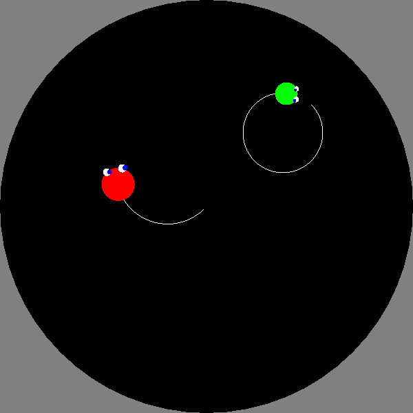
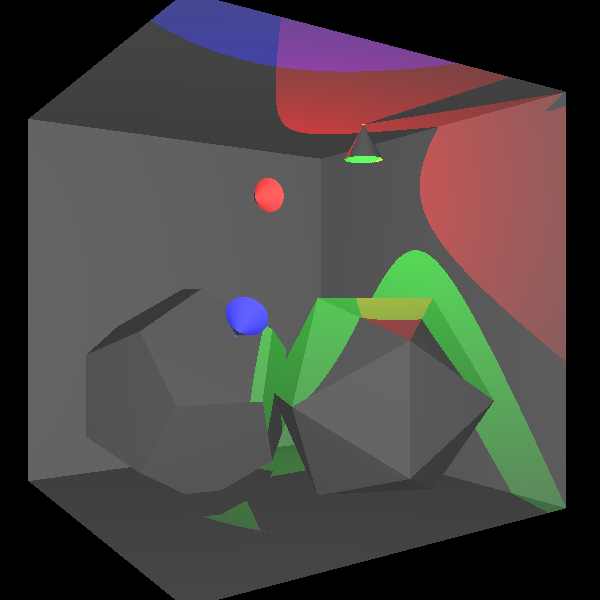
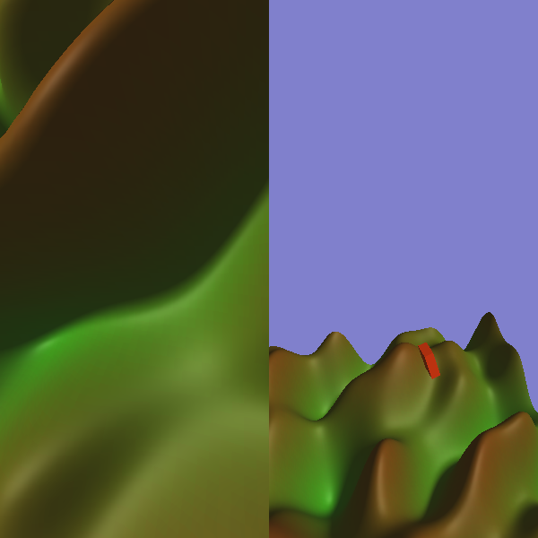
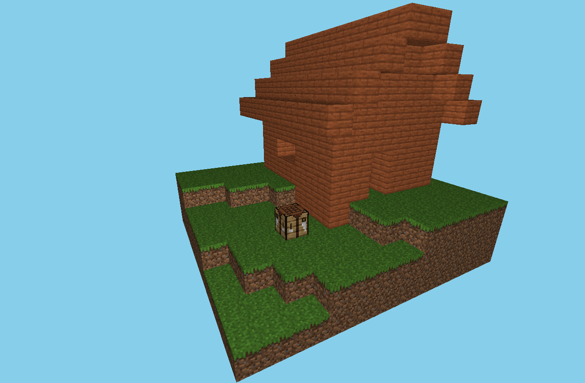

# Grafika
Számítógépes grafika házi feladatok (2023 tavasz, 2022/23/2 félév)

## Környezet

Feltételezzük a [Linux starter pack](https://git.sch.bme.hu/bobarna/grafika-linux-starter-pack/) által előállított környezetet. Windowson is fordítható, futtatható kell legyen a kód, a tárgyban használt környezettel, a többi példaprogramhoz hasonlóan.

Az egyszerűség kedvéért nem nagyon nyúltam bele a cmake-fileba (csak az unused paraméter warningot némítottam el, és a debug információk beletételét kapcsoltam be), így az a `Skeleton.cpp` létezését feltételezi. Ennek megfelelően például a 2. házi fordításához a következő szükséges klónozás után:

```sh
mv hazi2.cpp Skeleton.cpp
./buildrun.sh
```
`hazi1.cpp`, `hazi2.cpp`, `hazi3.cpp` és `haziMC.cpp` a 4 forrásfájl, melyek közül pontosan egy legyen `Skeleton.cpp`-re átnevezve, hogy sikeres legyen a fordítás.

A szorgalmi futtatásához szükséges, hogy a `textures` mappa legyen az aktuális working directory, hogy a program megtalálja a betöltendő textúrákat. Ha az itt található `buildrun.sh`-t használjuk a fordítás és futtatáshoz, akkor az elegendő kell legyen.

## Házi 1: UFO Hami



## Házi 2: Lehallgató



## Házi 3: Bungee Jumping



## Szorgalmi: Minecraft copy



# Copyright notice

A `textures` mappa tartalma a Mojang tulajdonát képezi.
